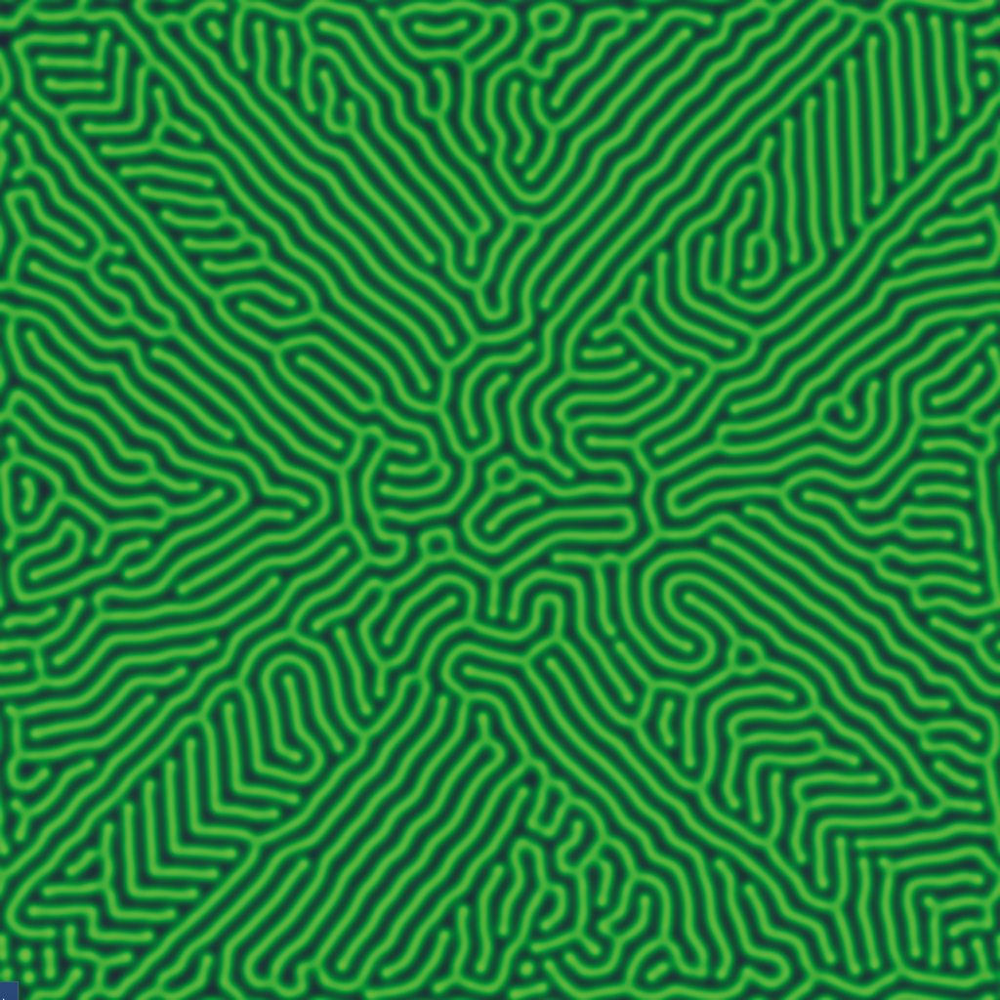
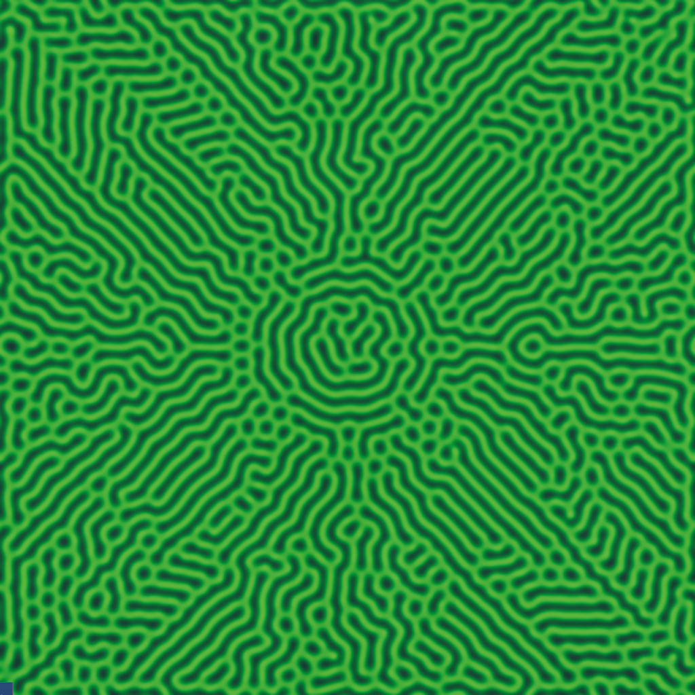
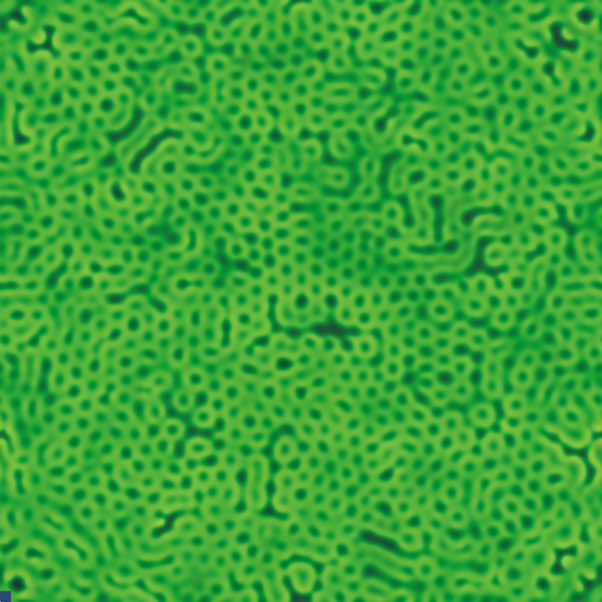
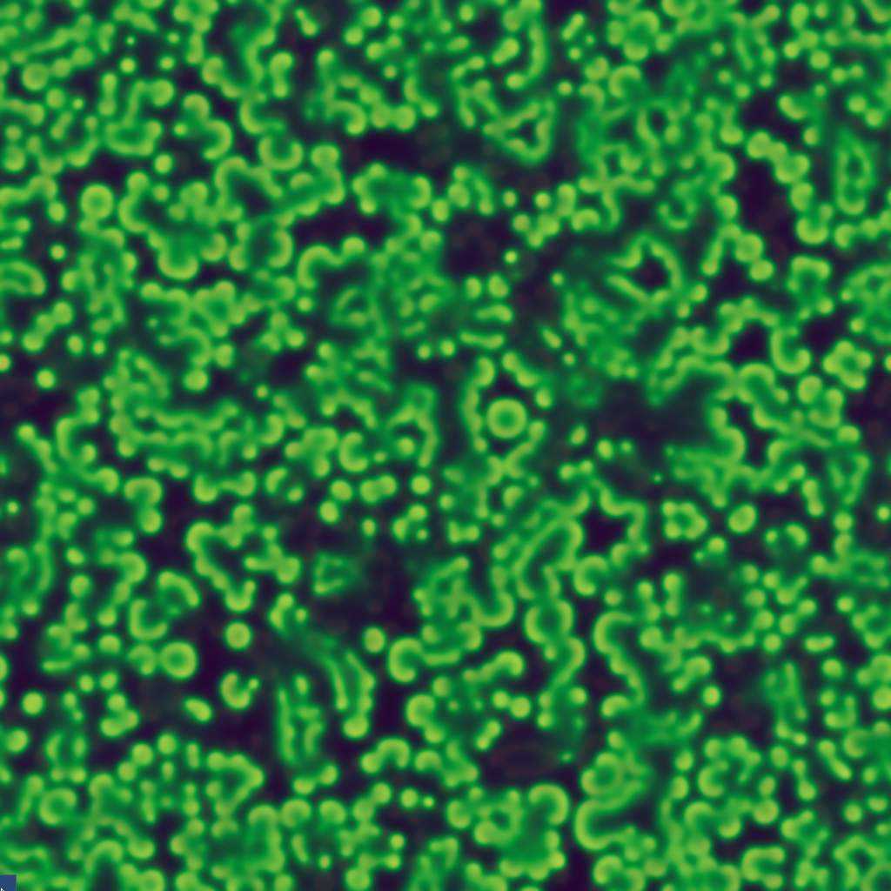
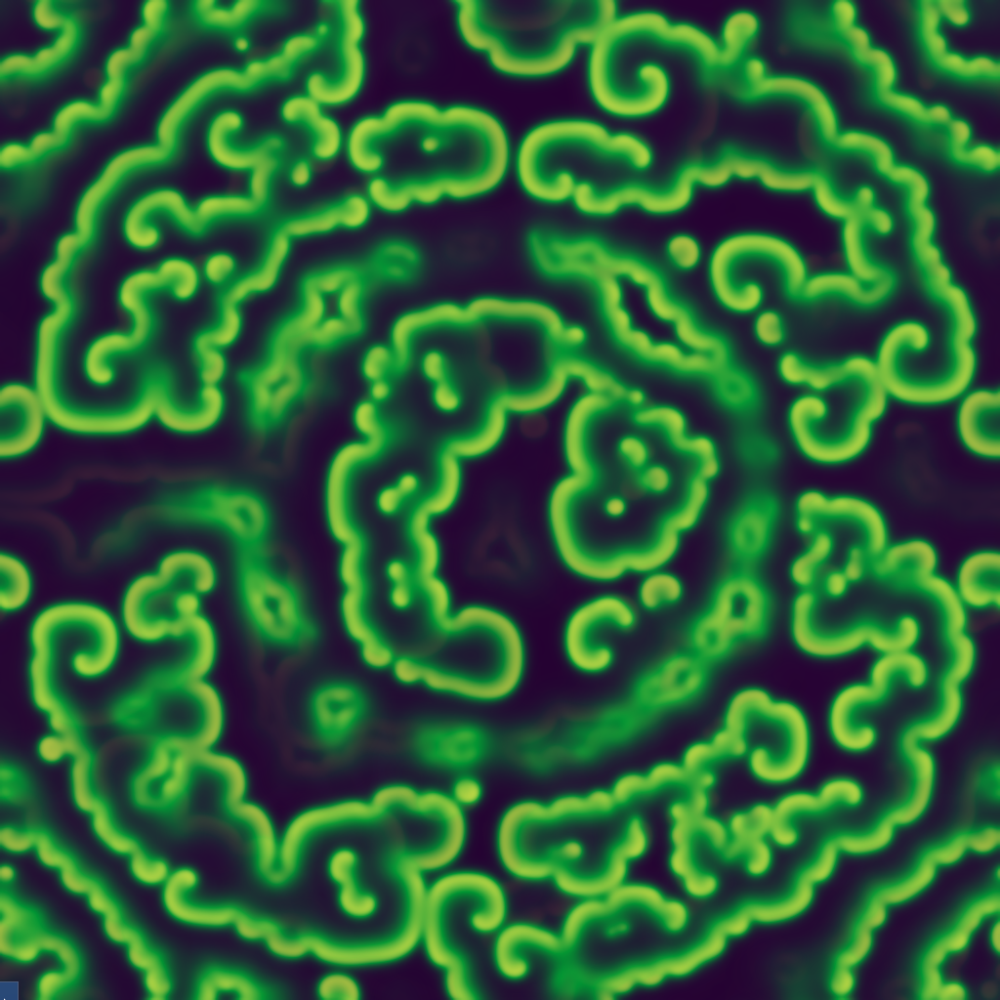
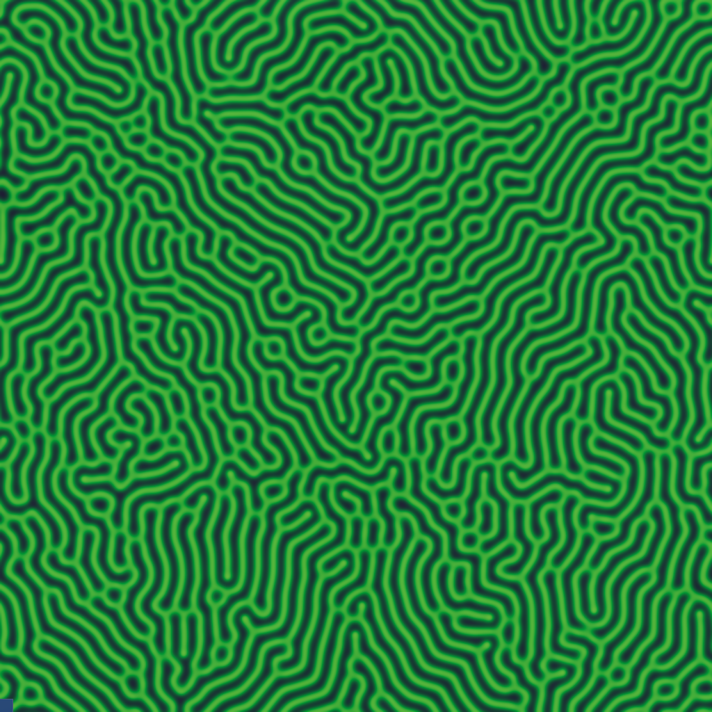
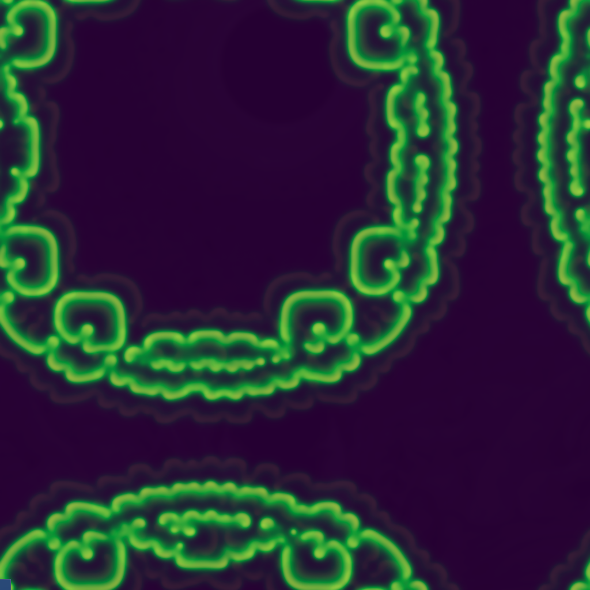
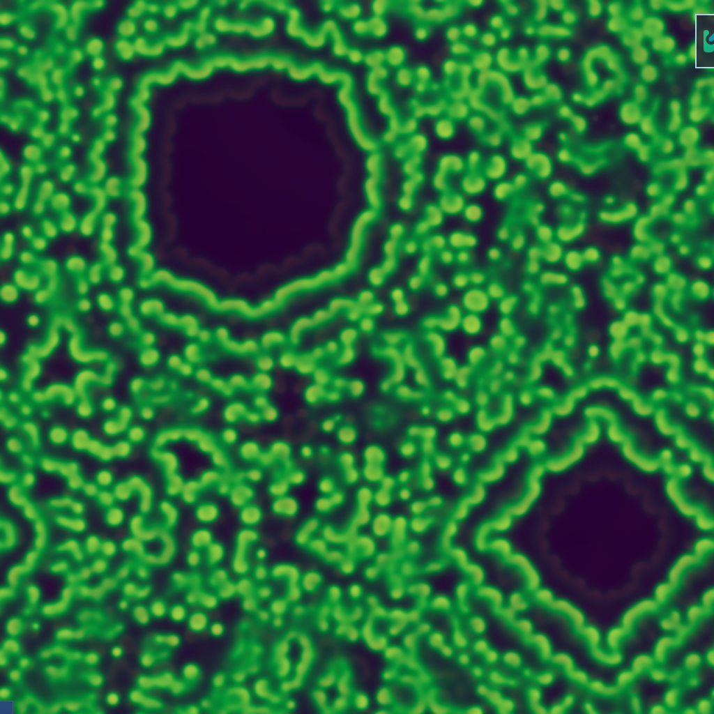
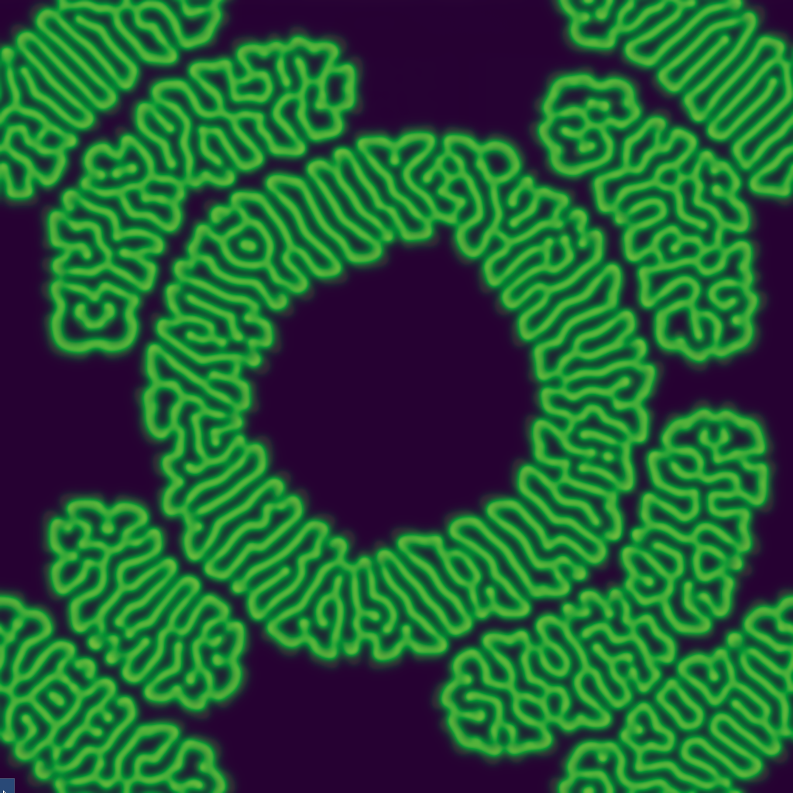

# Grey-Scott Simulation

Real-time reaction-diffusion simulation using OpenCL and OpenGL.

<table>
  <tr>
    <td width="33%">
      
      <p align="center"><em>Pattern 1</em></p>
    </td>
    <td width="33%">
      
      <p align="center"><em>Pattern 2</em></p>
    </td>
    <td width="33%">
      
      <p align="center"><em>Pattern 3</em></p>
    </td>
  </tr>
  <tr>
    <td width="33%">
      
      <p align="center"><em>Pattern 4</em></p>
    </td>
    <td width="33%">
      
      <p align="center"><em>Pattern 5</em></p>
    </td>
    <td width="33%">
      
      <p align="center"><em>Pattern 6</em></p>
    </td>
  </tr>
  <tr>
    <td width="33%">
      
      <p align="center"><em>Pattern 7</em></p>
    </td>
    <td width="33%">
      
      <p align="center"><em>Pattern 8</em></p>
    </td>
    <td width="33%">
    </td>
    <td width="33%">
      
      <p align="center"><em>Pattern 8</em></p>
    </td>
    <td width="33%">
    </td>
  </tr>
</table>

## Build

**Dependencies:** CMake 3.15+, SDL2, OpenCL, OpenGL 4.6, GLEW, ImGui

```bash
# Arch Linux
sudo pacman -S cmake gcc sdl2 opencl-headers ocl-icd mesa glew imgui

# Ubuntu/Debian
sudo apt install cmake g++ libsdl2-dev opencl-headers ocl-icd-opencl-dev libglew-dev

# Build
mkdir build && cd build
cmake ..
cmake --build . -j$(nproc)
./GreyScottSim
```

## Controls

| Key | Action |
|-----|--------|
| **Space** | Pause/Resume |
| **R** | Reset simulation |
| **C** | Toggle CPU/GPU implementation |
| **ESC** | Quit |
| **↑/↓** | Adjust F (feed rate) |
| **←/→** | Adjust k (kill rate) |
| **F1-F5** | Pattern presets (spots, stripes, waves, chaos, holes) |

## Code Structure

```
grey-scott-sim/
├── include/                            # Header files
├── src/                                # Source files
│   ├── main.cpp                        # Program entry point
│   ├── core/
│   │   └── Application.cpp             # Event loop, input handling, ImGui overlay
│   ├── compute/
│   │   ├── ComputeManager.cpp          # OpenCL context and queue setup
│   │   └── Simulation.cpp              # GPU Grey-Scott implementation
│   ├── cpu/
│   │   └── SimulationCPU.cpp           # CPU Grey-Scott reference implementation
│   ├── graphics/
│   │   └── Renderer.cpp                # OpenGL texture rendering, shaders
│   ├── imgui_impl_opengl3.cpp          # ImGui OpenGL backend implementation
│   └── imgui_impl_sdl2.cpp             # ImGui SDL2 backend implementation
│
├── kernels/
└── build/
```

## Project Info

Academic project for GPU Programming course. Demonstrates parallel computing concepts, performance analysis, and real-time graphics.
